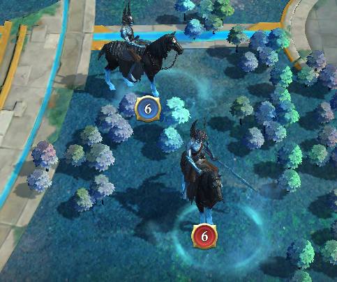

## Definitions

**Alliances** or **signing alliances** are these alliances in kingdom 10229 that represent the TOP-placed alliances of the kingdom 10229.

- The number of referenced alliances is defined by the non-attack agreement (NAP)
- All leaders of the signing alliances have to sign the agreement.

**Affiliated alliances** are those farm alliances associated with one of the main signing alliances of this agreement.

**Players** represent any member of one of the alliances or of either of their affiliated alliances. There is no further distinction between players, be it by signing or affiliated alliances.

The **dark forest** is the blue area in the middle of the map, containing the citadel in its center.

The **horses** are the targets in the event "Lost Revenants". The players and alliances must kill the horses in order to gain points and rewards.

Single players can **solo** the horses (aka kill them in a direct attack) or **rally** them together with other alliance members.

**Private messages (PMs)** are in-game messages between the players.

Any player can send a **spy** to the strongholds of the players of foreign alliances. This is called **spying** on the player.

## Claims

1. Killing of horses outside the dark forest is not restricted. Any player or alliance can kill them (solo or rally is allowed).
   1. Taking horses from other alliances' territory is allowed.
2. Inside the forest, additional restrictions are in effect.
   1. Horses in the levels 8 and 9 are reserved for rallies by the alliances.
      1. Solo kills should be avoided and only done in time slots of low playing activity in the kingdom.
      2. If an alliance wants to run rallies against the horses, all solo efforts are to be stopped immediately. To notify of the intention to run rallies, the alliance should post PMs to any players doing solos. Additionally, the rally leader might send a spy to the stronghold of the player doing solos to make the window flash red.
      3. Once an alliance proclaims to do rallies, no player from either alliance should do solos. So, all players (also from the proclaiming alliance) are bound to rally-only playing.
   2. Horses in the levels 1 through 7 can be killed arbitrarily.
      1. Both solo and rallies are allowed.
      2. However, for fair playing, the restrictions in 2.1 for higher-leveled horses should be obeyed on a voluntary basis for the lower-leveled horses as well.

## Final acknowledgement

We, the leaders of the signing alliances in the kingdom 10229 have read and agreed to the terms above. We hereby bind our alliances and affiliated alliances to obey the rules and restrictions imposed. We will inform the members of our alliances as well as the leaders and members of our affiliated alliances about the agreement. Further, we will encourage our members to look at the published version of the agreement at regular intervals to keep them informed.

Any changes to this agreement require a vote of the delegates in the corresponding agreement working group. For the changes to be accepted, at least 2/3 of the alliances must agree. The published version will then be updated and will be in effect immediately or with the defined due date.

## Changelog

| Date             | Version          | Changes         |
|------------------|------------------|-----------------|
| 2015-02-06 | 1.0 | Initial version |
