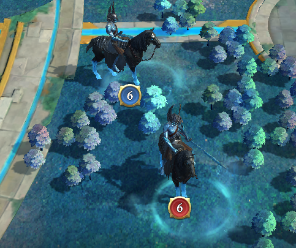

## Définitions

**Les alliances ou alliances signataires** sont les alliances du royaume 10229 qui représentent les alliances les mieux placées du royaume 10229.

- Le nombre d'alliances référencées est défini par l'accord de non-attaque (NAP)
- Tous les chefs des alliances signataires doivent signer l'accord.

**Les alliances affiliées** sont les alliances agricoles associées à l'une des principales alliances signataires de cet accord.

Les **joueurs** représentent tout membre de l'une des alliances ou de l'une de leurs alliances affiliées. Il n'y a pas d'autre distinction entre les joueurs, qu'il s'agisse de la signature ou des alliances affiliées.

La **forêt sombre** est la zone bleue au milieu de la carte, contenant la citadelle en son centre.

Les **chevaux** sont les cibles de l'événement « Lost Revenants ». Les joueurs et les alliances doivent tuer les chevaux pour gagner des points et des récompenses.

Les joueurs individuels peuvent **solo** les chevaux (c'est-à-dire les tuer en les attaquant directement) ou **rally** les chevaux avec d'autres membres de l'alliance.

Les **messages privés (MP)** sont des messages en jeu entre les joueurs.

Tout joueur peut envoyer un **espion** dans les fiefs des joueurs d'alliances étrangères. C'est ce qu'on appelle **espionner** le joueur.

## Revendications

1. La mise à mort des chevaux en dehors de la forêt noire n'est pas restreinte. N'importe quel joueur ou alliance peut les tuer (solo ou rallye autorisé). 
   1. Prendre des chevaux sur le territoire d'autres alliances est autorisé.
2. A l'intérieur de la forêt, des restrictions supplémentaires sont en vigueur. 
   1. Les chevaux des niveaux 8 et 9 sont réservés aux rallyes des alliances. 
      1. Les tueries en solo doivent être évitées et réalisées uniquement dans les créneaux horaires où l'activité ludique est faible dans le royaume.
      2. Si une alliance veut organiser des rallyes contre les chevaux, tous les efforts en solo doivent être arrêtés immédiatement. Pour notifier l'intention d'organiser des rallyes, l'alliance doit envoyer des MP à tous les joueurs qui font des solos. De plus, le leader du rallye peut envoyer un espion dans la forteresse du joueur qui fait des solos pour faire clignoter la fenêtre en rouge.
      3. Une fois qu'une alliance proclame faire des rallyes, aucun joueur de l'une ou l'autre alliance ne doit faire de solos. Ainsi, tous les joueurs (y compris ceux de l'alliance qui a proclamé le ralliement) sont obligés de jouer uniquement des ralliements.
   2. Les chevaux des niveaux 1 à 7 peuvent être tués arbitrairement. 
      1. Les solos et les rallyes sont autorisés.
      2. Cependant, pour des raisons de fair-play, les restrictions énoncées au point 2.1 pour les chevaux de niveau supérieur doivent être respectées volontairement pour les chevaux de niveau inférieur.

## Reconnaissance finale

Nous, chefs des alliances signataires dans le royaume 10229, avons lu et accepté les conditions ci-dessus. Par la présente, nous engageons nos alliances et les alliances affiliées à respecter les règles et les restrictions imposées. Nous informerons les membres de nos alliances ainsi que les chefs et les membres de nos alliances affiliées de cet accord. En outre, nous encouragerons nos membres à consulter régulièrement la version publiée de l'accord afin de les tenir informés.

Toute modification de cet accord nécessite un vote des délégués du groupe de travail correspondant. Pour que les changements soient acceptés, au moins 2/3 des alliances doivent être d'accord. La version publiée sera alors mise à jour et entrera en vigueur immédiatement ou à la date d'échéance définie.

Traduit avec DeepL.com (version gratuite)
