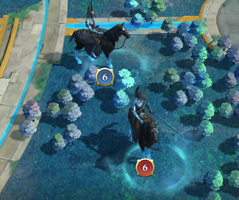

There are some definitions and explanations below.
Consider this as a glossary to simplify the text and enhance its readability.

## Claims

### 1. Level of Horses

1. Horses of levels 1 through 7 (inclusively) are generally unrestricted.
   The players are not enforced to adhere to following rules (section 2. onwards).
   1. Any player can attack them.
   1. Both solo and rallies are allowed.
   1. However, for fair playing, the restrictions for higher-leveled horses of level 8/9 should be obeyed on a voluntary basis for the lower-leveled horses as well.
1. Higher leveled horses (levels 8 and 9) are restricted. The following rules apply.

### 2. Location of the horses

1. Killing of horses within the dark forest is restricted according to the rules below.
1. Taking horses from other alliances' territory is conditional:
   1. If the other alliance is not capable to kill the corresponding horse (e.g. as it is a weak farming alliance), killing is allowed.
   1. If the other alliance is capable of killing the horse, it must not be taken from the foreign territory.
1. Killing of horses outside the dark forest and outside foreign alliance territory is not restricted. Any player or alliance can kill them (solo or rally is allowed).

### 3. Time schedule -- rally days and solo days

1. The event is separated into solo and rally days.
   Solo days are Saturday 0:00 to 23:59 UTC.
   All other days are rally days.
1. On solo days, no additional restrictions are in place (also for the dark forest) and anyone can kill any horse.
1. On rally days, additional restrictions are in place for the horses [levels 8/9].
   1. Solo kills should be avoided and only done in time slots of low playing activity in the kingdom.
   1. If an alliance wants to run rallies against the horses, all solo efforts are to be stopped immediately.
      To notify of the intention to run rallies, the alliance should post PMs to any players doing solos.
      Additionally, the rally leader might send a spy to the stronghold of the player doing solos to make the window flash red.
   1. Once an alliance proclaims to do rallies, no player from either alliance should do solos.
      So, all players (also from the proclaiming alliance) are bound to rally-only playing.

## Definitions

**Alliances** or **signing alliances** are these alliances in kingdom 10229 that represent the TOP-placed alliances of the kingdom 10229.

- The number of referenced alliances is defined by the non-attack agreement (NAP)
- All leaders of the signing alliances have to sign the agreement.

**Affiliated alliances** are those farm alliances associated with one of the main signing alliances of this agreement.

**Players** represent any member of one of the alliances or of either of their affiliated alliances. There is no further distinction between players, be it by signing or affiliated alliances.

The **dark forest** is the blue area in the middle of the map, containing the citadel in its center.

The **horses** are the targets in the event "Lost Revenants". The players and alliances must kill the horses in order to gain points and rewards.

Single players can **solo** the horses (aka kill them in a direct attack) or **rally** them together with other alliance members.

**Private messages** (**PMs**) are in-game messages between the players.

Any player can send a **spy** to the strongholds of the players of foreign alliances. This is called **spying** on the player.

## Changelog

| Date       | Version | Changes                  |
| ---------- | ------- | ------------------------ |
| 2025-02-06 | 1.0     | Initial version          |
| 2025-02-09 | 1.0.1   | Added French translation |
| 2026-08-26 | 1.0.2   | Add solo and rally days  |
|            |         | Restructure text         |
